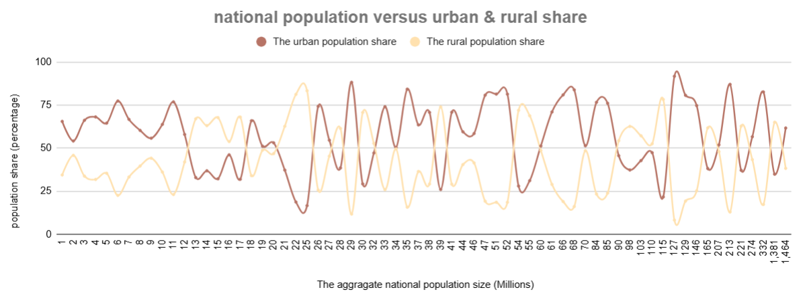
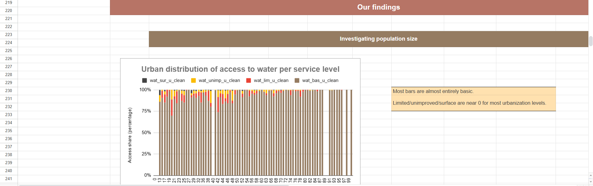
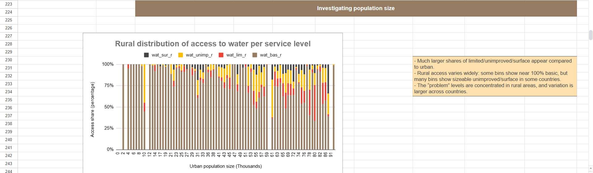
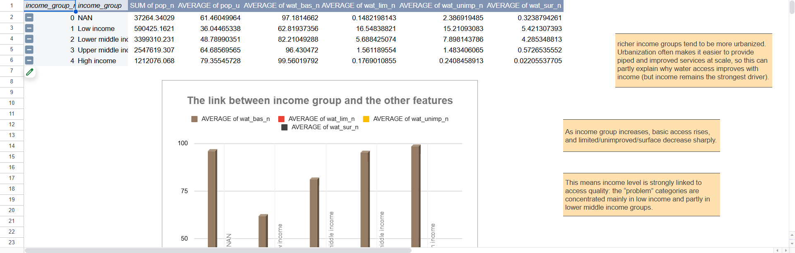

# Access to Drinking Water — Part 1: Understanding the Data

## Project Overview

This project analyzes global access to drinking water using country-level estimates for 2020.

The analysis focuses on understanding how drinking water access varies across national, urban, and rural populations, and how service-level quality changes across income groups.

The project was completed using Google Sheets as the main analytical workspace, with a focus on data cleaning, feature engineering, summary statistics, pivot table analysis, and visual storytelling.

---

## Analytical Objective

The objective of this part of the project is to understand the structure of the drinking water access dataset and identify the main patterns behind global water access inequality.

The analysis focuses on four core questions:

1. How does national population size relate to urban and rural population shares?
2. How is drinking water access distributed across national, urban, and rural populations?
3. Do rural and urban populations experience different levels of access inequality?
4. How does income group relate to national drinking water access quality?

---

## Working Spreadsheet

The full Google Sheets workbook used for the analysis is available here:

[Open Google Sheets Workbook](https://docs.google.com/spreadsheets/d/1pCvSjxteW4hK8SEjsLpVBqPaN8d4gcre0Xm61JzAP44/edit?usp=sharing)

The workbook contains:

- the original dataset
- cleaned and transformed fields
- derived features
- summary statistics
- visualizations
- pivot table analysis
- sheet-level analytical outputs

---

## Dataset

The dataset contains country-level estimates for drinking water access in 2020.

Main variables include:

| Variable | Description |
|---|---|
| `name` | Country or area name |
| `income_group` | Country income classification |
| `pop_n` | National population size estimate, measured in thousands |
| `pop_u` | Urban population share, expressed as a percentage |
| `wat_bas_n` | National share with at least basic drinking water access |
| `wat_lim_n` | National share with limited drinking water access |
| `wat_unimp_n` | National share with unimproved drinking water access |
| `wat_sur_n` | National share relying on surface water |
| `wat_bas_r` | Rural share with at least basic drinking water access |
| `wat_bas_u` | Urban share with at least basic drinking water access |

The water access variables are grouped into four service levels:

- **At least basic**
- **Limited**
- **Unimproved**
- **Surface water**

For full variable documentation, see:

[data/Data_dictionary.md](./data/Data_dictionary.md)

---

## Tools and Techniques Used

This project demonstrates the use of spreadsheet-based data analysis techniques, including:

- data cleaning and validation
- handling missing and inconsistent values
- feature engineering
- percentage-based calculations
- summary statistics
- interquartile range and standard deviation analysis
- pivot table aggregation
- 100% stacked column charts
- line chart analysis
- box-and-whisker style interpretation
- data storytelling and analytical reporting

---

## Data Preparation and Feature Engineering

Several derived features were created to support the analysis.

| Feature | Purpose |
|---|---|
| `value_cnt` | Counts non-empty values in each row to validate row completeness |
| `pop_u_val` | Estimates the urban population count using national population and urban share |
| `pop_r` | Calculates rural population share as the complement of urban share |
| `pop_n (m)` | Converts national population into a rounded million-based feature for visualization |
| `pop_u (rounded)` | Rounds urban population share for grouped visual analysis |
| `pop_r (rounded)` | Rounds rural population share for grouped visual analysis |
| cleaned water-access fields | Improve chart reliability by reducing issues caused by missing or inconsistent values |

These transformations helped make the dataset easier to validate, summarize, visualize, and interpret.

---

## Repository Structure

- `assets/`  
  Contains the main exported visuals used in the analysis.

- `data/`  
  Contains dataset documentation and the data dictionary.

- `reports/`  
  Contains the analytical report and spreadsheet sheet exports.

Inside the `reports/` folder:

- `analytical_report/` contains the full written analytical report.
- `sheet_exports/` contains PDF exports of the main Google Sheets analysis tabs.

---

## Key Visuals

### 1. Population vs Urban/Rural Share

This visual compares national population size with urban and rural population shares.

**Main insight:**  
Population size alone does not explain urbanization structure. Countries with similar population sizes can have very different urban and rural population shares.

---

### 2. Urban Distribution of Access to Water per Service Level

This visual shows how urban populations are distributed across the four drinking water service levels.

**Main insight:**  
Urban populations generally show strong access to at least basic drinking water services. Limited, unimproved, and surface-water access remain small and concentrated in selected countries.

---

### 3. Rural Distribution of Access to Water per Service Level

This visual shows how rural populations are distributed across the four drinking water service levels.

**Main insight:**  
Rural populations show greater inequality than urban populations. Limited, unimproved, and surface-water categories are more visible in rural areas.

---

### 4. Income Group vs Service Levels

This visual compares average national drinking water access across income groups.

**Main insight:**  
Income group is strongly associated with drinking water access quality. As income level increases, at least basic access rises sharply, while limited, unimproved, and surface-water access decline toward zero.

---

## Main Findings

### 1. National basic water access is generally high

At the national level, access to at least basic drinking water is the dominant service category in most observations.

Limited, unimproved, and surface-water access are generally smaller, but still important in selected countries.

---

### 2. Urban areas show the strongest access profile

Urban populations have the highest and most stable access to at least basic drinking water.

Surface-water reliance is nearly absent in most urban observations, and lower service levels are concentrated in specific countries.

---

### 3. Rural areas show greater inequality

Rural populations are more exposed to limited, unimproved, and surface-water services.

Rural basic access remains common, but it is less stable and more variable than urban basic access.

---

### 4. Population size alone does not explain water access quality

The population-based visuals do not show a clear direct relationship between population size and drinking water access quality.

This suggests that population size is not sufficient as a standalone explanatory factor.

---

### 5. Income group is strongly associated with access quality

Income group provides one of the clearest patterns in the analysis.

Low-income countries show the lowest average basic access and the highest exposure to limited, unimproved, and surface-water categories. High-income countries approach universal access to at least basic drinking water.

---

## Reports

The full analytical report is available here:

[Part1_Analytical_Report.md](./reports/analytical_report/Part1_Analytical_Report.md)

Supporting spreadsheet exports are available here:

[sheet_exports/](./reports/sheet_exports/)

The analytical report provides the full project interpretation, while the sheet exports preserve the final Google Sheets outputs for transparency and documentation.

---

## Data Documentation

Dataset documentation is available here:

[data/README.md](./data/README.md)

Full variable documentation is available here:

[data_dictionary.md](./data/data_dictionary.md)

---

## Visual Assets

The visual assets folder is available here:

[assets/](./assets/)

It contains the main exported visuals used to support the analysis and reporting.

---

## Limitations

This analysis is descriptive and exploratory. It identifies patterns and relationships, but it does not prove causality.

Main limitations include:

- the analysis focuses on 2020 estimates only
- missing values may affect some country-level comparisons
- some variables required cleaning before analysis
- population size does not capture infrastructure quality, geography, governance, or investment capacity
- income group is a useful segmentation variable, but it does not explain all country-level differences

---

## Future Improvements

This project could be strengthened further by:

- adding regional segmentation
- analyzing multiple years to identify trends over time
- calculating population-weighted access indicators
- building an interactive dashboard
- reproducing the analysis in Python or R
- applying clustering or regression models to identify stronger predictors of water access inequality
- ranking countries by lowest basic access and highest surface-water reliance

---

## Skills Demonstrated

This project demonstrates the following data analysis skills:

- data cleaning
- feature engineering
- spreadsheet modeling
- summary statistics
- pivot table analysis
- visual analytics
- comparative analysis
- data storytelling
- documentation
- portfolio reporting

---

## Final Conclusion

I found that income group produced one of the clearest descriptive patterns in the analysis. Basic access increased consistently across higher income classifications, while limited, unimproved and surface-water access declined. However, the grouped averages did not isolate the effect of income from urbanization or other structural factors.
