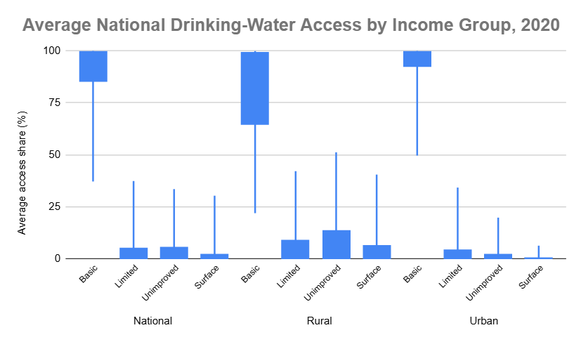
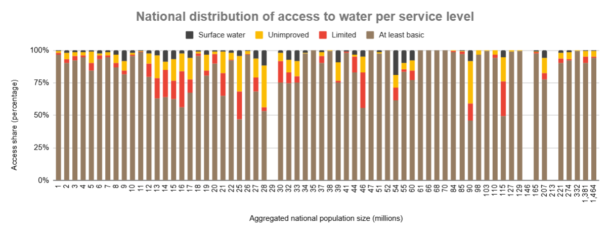
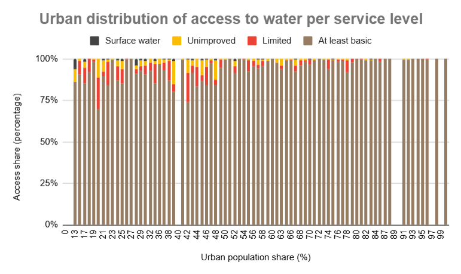
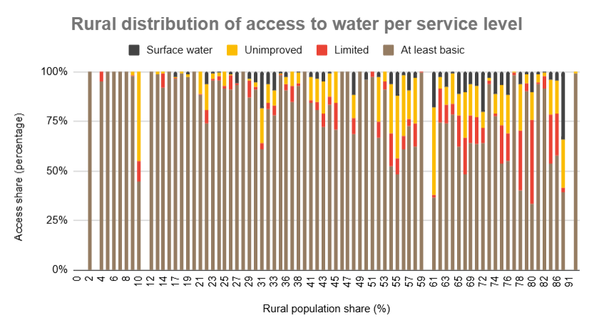
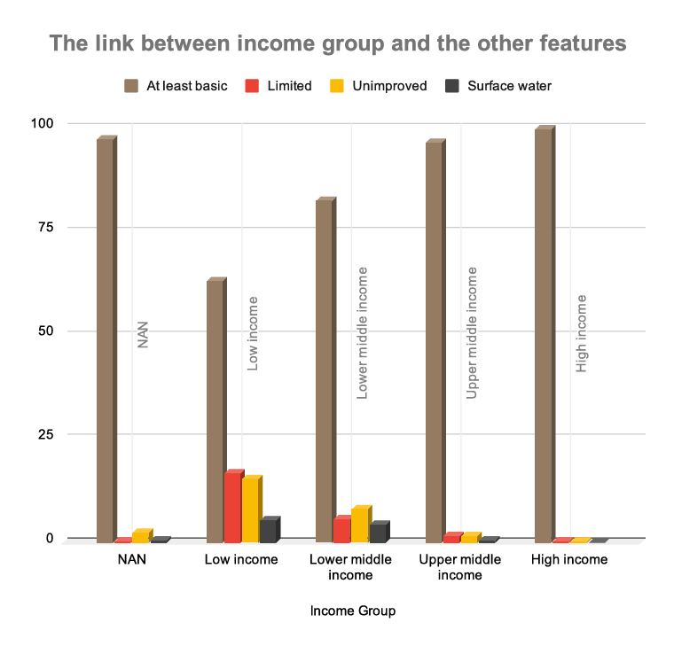

# Part 1 Analytical Report — Access to Drinking Water

## Project overview

In this part of the project, I analyzed country-level drinking-water access in 2020 using Google Sheets.

My objective was to examine how access to drinking water differed:

- Between national, urban, and rural areas
- Across the four drinking-water service levels
- According to population distribution
- Across World Bank income groups

I organized the analysis into four reporting sheets:

1. **Global 2020 Report**
2. **Urban 2020 Report**
3. **Rural 2020 Report**
4. **Pivot Table**

Together, these sheets provide a structured view of geographic inequality, urban–rural disparities, service-level composition, and the relationship between income classification and drinking-water access.

The complete variable definitions are available in the [Data Dictionary](../../data/Data_dictionary.md).

---

## Executive summary

My analysis shows that access to at least basic drinking-water services was generally high in 2020, but the national averages conceal substantial differences between urban and rural populations.

Urban areas recorded an average at-least-basic access rate of approximately **94.69%**, compared with **81.34%** in rural areas. Rural areas also had higher average reliance on limited, unimproved, and surface-water services.

The distribution analysis confirms that rural access was not only lower but also considerably more unequal across countries. Rural at-least-basic access had a substantially wider interquartile range than its urban equivalent.

The income-group analysis identified a strong descriptive association between national income classification and access to drinking water. Average at-least-basic access increased from approximately **62.82%** in low-income countries to **99.56%** in high-income countries.

These findings indicate that the main drinking-water access challenge is not simply the global availability of basic services. It is the unequal distribution of those services, particularly across rural populations and lower-income country groups.

---

## Data source and analytical scope

I used country-level estimates from the WHO/UNICEF Joint Monitoring Programme for Water Supply, Sanitation and Hygiene.

The analysis focuses on the year **2020** and includes national, urban, and rural estimates of the following drinking-water service levels:

- At least basic
- Limited
- Unimproved
- Surface water

According to the JMP drinking-water service ladder:

- **At least basic** includes drinking water from an improved source where collection time does not exceed 30 minutes for a round trip, including queuing.
- **Limited** refers to an improved source requiring more than 30 minutes for a round trip.
- **Unimproved** includes sources such as unprotected wells and unprotected springs.
- **Surface water** refers to water collected directly from rivers, dams, lakes, ponds, streams, canals, or irrigation channels.

Official source references:

- [JMP drinking-water data](https://washdata.org/data)
- [JMP drinking-water service levels](https://washdata.org/topics/drinking-water)
- [JMP estimation methods](https://washdata.org/topics/methods/estimation-methods)

---

# Methodology

## 1. Source variables

I retained the source variables needed to identify each country and analyze its population and drinking-water access.

The main source-variable groups were:

| Variable group | Examples | Analytical purpose |
|---|---|---|
| Country identifiers | Country name and country code | Identifying individual observations |
| Geographic classification | Region | Supporting geographic interpretation |
| Economic classification | `income_group` | Comparing access across income groups |
| Population | `pop_n`, `pop_u` | Measuring national population and urban population share |
| National water access | `wat_bas_n`, `wat_lim_n`, `wat_unimp_n`, `wat_sur_n` | Measuring national service-level distribution |
| Urban water access | `wat_bas_u`, `wat_lim_u`, `wat_unimp_u`, `wat_sur_u` | Measuring urban service-level distribution |
| Rural water access | `wat_bas_r`, `wat_lim_r`, `wat_unimp_r`, `wat_sur_r` | Measuring rural service-level distribution |

I kept source variables separate from derived and cleaned features so that the original values remained traceable throughout the analysis.

---

## 2. Structural validation

I created `value_cnt` to verify whether each imported record contained the expected number of populated fields.

The Google Sheets formula was:

```gs
=COUNTA(A2:P2)
```

A valid record was expected to contain **16 populated source fields**.

I used this validation because malformed imports can shift values into the wrong columns and create incorrect calculations without generating an obvious error.

The validation identified five malformed records. I corrected their structure using:

> Data → Split text to columns

After correcting the affected rows, I repeated the validation before continuing with the analysis.

---

## 3. Derived population features

### Urban population value

I calculated the estimated urban population by multiplying the national population by the urban population share:

```gs
=pop_n_cell*pop_u_cell/100
```

I created this feature to convert the urban share from a percentage into an estimated population value.

### Rural population share

I derived the rural population share as the complement of the urban share:

```gs
=100-pop_u_cell
```

This calculation assumes that the national population is divided between urban and rural populations.

### National population in millions

I converted the national population from thousands to rounded millions using:

```gs
=ROUNDUP(pop_n_cell/1000,0)
```

I created `pop_n (m)` to produce more readable population categories for aggregation and visualization.

### Rounded urban and rural shares

I rounded the urban and rural population shares to whole-number categories:

```gs
=IFERROR(ROUND(pop_u_cell,0),"NAN")
```

```gs
=IFERROR(ROUND(pop_r_cell,0),"NAN")
```

These features allowed me to group countries with similar population structures when producing the urban and rural distribution charts.

`NAN` identifies records for which the corresponding value could not be converted into a valid number. I treated these values as missing categories rather than numerical observations.

---

## 4. Cleaning the service-level variables

I created cleaned versions of the service-level variables in the Global, Urban, and Rural report sheets.

The cleaned fields were:

- `wat_bas_*_clean`
- `wat_lim_*_clean`
- `wat_unimp_*_clean`
- `wat_sur_*_clean`

The asterisk represents the relevant area:

- `n` for national
- `u` for urban
- `r` for rural

A representative Google Sheets formula was:

```gs
=IF(COUNT($D2:$G2)=4,MIN(100,MAX(0,$D2)),)
```

I copied this formula across the four service-level columns and then down the dataset.

In each report sheet, `$D2:$G2` represents the four related service values for that record.

The formula performs three checks:

1. `COUNT($D2:$G2)=4` confirms that all four service values are numeric.
2. `MAX(0,$D2)` prevents a percentage from falling below 0%.
3. `MIN(100,...)` prevents a percentage from exceeding 100%.

If the four service values were not all available, I returned a blank result rather than calculating a partial service distribution.

This complete-case rule was important because the four service levels represent components of the same drinking-water access distribution.

---

## 5. Summary statistics

For the cross-country distribution analysis, I calculated:

```gs
=MIN(range)
```

```gs
=QUARTILE(range,1)
```

```gs
=MEDIAN(range)
```

```gs
=AVERAGE(range)
```

```gs
=QUARTILE(range,3)
```

```gs
=MAX(range)
```

I used these statistics to evaluate both central tendency and inequality.

The average describes the overall country-level position, while the median and quartiles show how the observations are distributed and whether the average is influenced by countries with unusually high or low values.

---

## 6. Aggregation methodology

For the population-share charts, I grouped countries by their rounded population measures and calculated the average cleaned service-level percentages in each group.

The chart values therefore represent **country-level averages within each displayed group**. They are not population-weighted global coverage estimates.

For the income analysis, I used a pivot table with:

- `income_group` as the row dimension
- Sum of national population as the population measure
- Average urban population share
- Average national service-level percentages

I created `income_group_num` to maintain the intended sorting order:

| `income_group_num` | Income category |
|---:|---|
| 0 | NAN |
| 1 | Low income |
| 2 | Lower middle income |
| 3 | Upper middle income |
| 4 | High income |

I treated `NAN` as an unclassified group and excluded it from ordered comparisons between income levels.

---

# Global 2020 Report

## Role of the sheet

I used the Global 2020 Report to create the principal country-level dataset for 2020 and compare national, urban, and rural access.

This sheet also contains the main statistical summaries and provides the cleaned data used in the national visualizations.

---

## Population size and urban–rural composition


### Chart methodology

I grouped countries by rounded national population size in millions and plotted:

- Average urban population share
- Average rural population share

Because the two shares are complementary, their combined value is approximately 100%.

The horizontal axis represents aggregated population-size categories rather than time. Therefore, I interpreted the visual as a comparison between population-size groups and not as a chronological trend.

### Interpretation

The chart shows substantial differences in urban–rural composition across national population-size groups.

Larger populations were not consistently more urban or more rural. Both highly urbanized and predominantly rural observations appeared across different population sizes.

This indicates that population size alone does not provide a sufficient explanation for a country's urban–rural structure. Countries with comparable population sizes may still have very different settlement patterns and, consequently, different infrastructure requirements.

---

## Access by area and service level



### Chart methodology

I used a candlestick chart as a box-and-whisker-style visualization.

For each area and service level, I configured the chart using:

- Low: minimum
- Open: first quartile
- Close: third quartile
- High: maximum

The visible box therefore represents the interquartile range between the first and third quartiles.

The chart does not display the median or mean directly. I calculated those values separately in the supporting summary table.

### Statistical findings

| Area and service level | Mean | Median | Interquartile range |
|---|---:|---:|---:|
| National — at least basic | 89.86% | 97.35% | 14.24 |
| Rural — at least basic | 81.34% | 90.73% | 34.29 |
| Urban — at least basic | 94.69% | 98.11% | 7.39 |
| Rural — surface water | 4.22% | 0.22% | 6.16 |
| Urban — surface water | 0.31% | 0.00% | 0.16 |

### Interpretation by service level

#### At least basic access

Urban at-least-basic access had the highest average and the narrowest interquartile range.

This means that basic access was both higher and more consistent across urban areas.

Rural at-least-basic access had the lowest average and the widest interquartile range. The wider rural box and longer lower whisker show that some countries remained substantially behind the overall distribution.

The principal pattern is therefore:

> Urban access was highest and most consistent, while rural access was lower and substantially more unequal.

#### Limited access

Limited access was generally low, but the rural distribution was wider than the urban distribution.

This indicates that limited service remained concentrated in a subset of countries and was more significant in rural areas.

#### Unimproved access

Urban unimproved access was concentrated close to zero.

The rural distribution was higher and more dispersed, indicating that unimproved sources were primarily a rural challenge and varied considerably across countries.

#### Surface water

Urban surface-water use was almost nonexistent for most countries.

Rural surface-water use remained low in the typical country, as shown by the rural median of only 0.22%. However, the higher average, wider interquartile range, and longer upper whisker indicate that a smaller group of countries had substantially greater rural dependence on surface water.

---

## National service-level distribution



### Chart methodology

I created a 100% stacked column chart using:

- Rounded national population size in millions as the grouping dimension
- Average cleaned national service-level percentages as the series

Each column represents the average national service distribution for the countries contained in that population-size group.

### Interpretation

At-least-basic access formed the largest component in almost every population-size category.

However, the proportion of limited, unimproved, and surface-water access varied considerably between categories.

The pattern was not strictly ordered by population size. Some relatively small population categories recorded high access, while others had substantial service deficits. Similar variation also appeared among larger population categories.

Therefore, the chart does not support the conclusion that national population size independently determines drinking-water access. It instead shows that significant access differences exist among countries with different population sizes.

---

## Global findings conclusion

The Global 2020 Report shows that high national averages can conceal important geographic inequalities.

Urban populations generally had higher and more consistent at-least-basic access. Rural populations recorded lower basic access and substantially wider cross-country variation.

The largest inequalities were concentrated in rural areas, where limited, unimproved, and surface-water services accounted for larger shares of the drinking-water distribution.

---

# Urban 2020 Report

## Role of the sheet

I used the Urban 2020 Report to isolate urban observations and examine how drinking-water service levels varied across urban population-share groups.

The analysis uses the cleaned urban variables:

- `wat_bas_u_clean`
- `wat_lim_u_clean`
- `wat_unimp_u_clean`
- `wat_sur_u_clean`

---

## Urban service-level distribution



### Chart methodology

I grouped countries by rounded urban population share and calculated the average cleaned urban service percentages for each group.

I then used a 100% stacked column chart to show how the four service levels combined within every displayed urbanization category.

### Average urban service distribution

| Urban service level | Average share |
|---|---:|
| At least basic | 94.69% |
| Limited | 3.28% |
| Unimproved | 1.72% |
| Surface water | 0.31% |

### Interpretation

At-least-basic access dominated the urban distribution across almost all urban population-share groups.

Limited, unimproved, and surface-water services generally represented small proportions of the total urban distribution. Surface-water reliance was especially rare, with an average of approximately 0.31%.

Some lower-urbanization groups contained larger limited or unimproved shares. However, the relationship was not perfectly linear, and individual country conditions still contributed to variation within the grouped results.

### Urban findings conclusion

The Urban 2020 Report shows that urban drinking-water access was close to universal in many countries.

The relatively high average and narrow cross-country distribution indicate that urban areas had more consistent access to at least basic services than rural areas.

Nevertheless, the remaining urban deficits should not be ignored. Limited and unimproved access was concentrated in a smaller number of countries and population groups, where the need for service improvement remained substantial.

---

# Rural 2020 Report

## Role of the sheet

I used the Rural 2020 Report to evaluate drinking-water access among rural populations and identify where access deficits were most concentrated.

The analysis uses the cleaned rural variables:

- `wat_bas_r_clean`
- `wat_lim_r_clean`
- `wat_unimp_r_clean`
- `wat_sur_r_clean`

Only records with four valid rural service values were included in the complete-case analysis.

This resulted in:

- **159 included country records**
- **54 excluded records with incomplete rural service distributions**
- **74 represented rounded rural-share groups**

---

## Rural service-level distribution



### Chart methodology

I grouped countries by rounded rural population share and calculated the average cleaned rural service percentages for each group.

I used a 100% stacked column chart so that each rural population-share group displayed the complete average service distribution.

### Average rural service distribution

| Rural service level | Average share |
|---|---:|
| At least basic | 81.34% |
| Limited | 5.84% |
| Unimproved | 8.73% |
| Surface water | 4.22% |

Percentages may differ slightly from 100% because of rounding and country-level estimation precision.

### Interpretation

Rural at-least-basic access was lower and more variable than urban access.

Groups with larger rural population shares generally displayed larger proportions of limited, unimproved, and surface-water services. However, this relationship was not perfectly monotonic, because countries with similar rural population shares may differ in geography, income, infrastructure, institutions, and investment levels.

The chart also shows that rural deficits were not limited to one service category. Depending on the country group, the population without at-least-basic access could be distributed across limited, unimproved, and surface-water services.

### Urban–rural comparison

| Service level | Urban average | Rural average | Rural minus urban |
|---|---:|---:|---:|
| At least basic | 94.69% | 81.34% | -13.35 percentage points |
| Limited | 3.28% | 5.84% | +2.56 percentage points |
| Unimproved | 1.72% | 8.73% | +7.01 percentage points |
| Surface water | 0.31% | 4.22% | +3.91 percentage points |

The largest service-level difference was in unimproved access, where the rural average exceeded the urban average by approximately **7.01 percentage points**.

### Rural findings conclusion

The Rural 2020 Report identifies rural populations as the main concentration of drinking-water inequality.

Rural areas had lower at-least-basic access, higher dependence on every lower service category, and greater cross-country dispersion.

These findings support prioritizing rural infrastructure and focusing intervention on countries where low rural basic access is combined with substantial reliance on unimproved or surface-water sources.

---

# Pivot Table Report

## Role of the sheet

I created the Pivot Table to summarize population, urbanization, and national drinking-water access by income group.

This aggregation connects the detailed country-level analysis with a broader socioeconomic comparison.

---

## Pivot-table configuration

### Rows

- `income_group`

### Values

- Sum of national population
- Average urban population share
- Average national at-least-basic access
- Average national limited access
- Average national unimproved access
- Average national surface-water access

### Sorting

I sorted the categories using `income_group_num`, from the unclassified group through low, lower-middle, upper-middle, and high income.

The service-level averages are unweighted country averages. Therefore, each included country contributes equally to its group average regardless of population size.

---

## Income group and service-level access



### Pivot-table findings

| Income category | Population represented (millions) | Average urban share | At least basic | Limited | Unimproved | Surface water |
|---|---:|---:|---:|---:|---:|---:|
| NAN | 37.26 | 61.46% | 97.18% | 0.15% | 2.39% | 0.32% |
| Low income | 590.43 | 36.04% | 62.82% | 16.55% | 15.21% | 5.42% |
| Lower middle income | 3,399.31 | 48.79% | 82.21% | 5.69% | 7.90% | 4.29% |
| Upper middle income | 2,547.62 | 64.69% | 96.43% | 1.56% | 1.48% | 0.57% |
| High income | 1,212.08 | 79.36% | 99.56% | 0.18% | 0.24% | 0.02% |

I converted the population totals from thousands to millions for readability in this report.

### Interpretation

The pivot table shows a clear descriptive gradient across the classified income groups.

Average at-least-basic access increased from:

- **62.82%** in low-income countries
- To **82.21%** in lower-middle-income countries
- To **96.43%** in upper-middle-income countries
- To **99.56%** in high-income countries

This represents a difference of approximately **36.74 percentage points** between the low-income and high-income groups.

Average urban population share also increased from **36.04%** in low-income countries to **79.36%** in high-income countries, a difference of approximately **43.31 percentage points**.

At the same time, the lower service categories declined substantially as income increased:

- Limited access declined from 16.55% to 0.18%.
- Unimproved access declined from 15.21% to 0.24%.
- Surface-water access declined from 5.42% to 0.02%.

The `NAN` category represents countries without a verified income classification in the working dataset. I kept it visible for transparency but did not treat it as part of the ordered income comparison.

### Pivot-table conclusion

The pivot analysis identifies income classification as one of the clearest descriptive dimensions associated with national drinking-water access in this dataset.

However, the analysis is descriptive and does not establish that income alone caused the observed differences. Other factors, such as geographic conditions, governance, infrastructure investment, conflict, population distribution, and institutional capacity, may also contribute to the relationship.

---

# Cross-sheet synthesis

The four sheets provide complementary evidence.

| Analytical dimension | Main finding |
|---|---|
| Global distribution | National averages conceal substantial cross-country differences. |
| Urban access | At-least-basic access was high and comparatively consistent. |
| Rural access | Basic access was lower, while limited, unimproved, and surface-water access were higher. |
| Distribution inequality | Rural at-least-basic access had the widest interquartile range. |
| Population structure | National population size alone did not produce a consistent access pattern. |
| Income group | Higher income groups had higher basic access and lower dependence on inferior service levels. |

The strongest recurring result was the urban–rural divide.

Urban populations had an average at-least-basic access rate of **94.69%**, compared with **81.34%** for rural populations. Rural areas also displayed substantially greater variation between countries.

The income-group analysis adds an important socioeconomic perspective. Countries in higher income groups had consistently better average service distributions, while low-income countries retained considerably larger limited, unimproved, and surface-water shares.

---

# Limitations

I considered the following limitations when interpreting the results:

1. **Country-level averages are unweighted.**  
   Most summary statistics give each country equal analytical weight, regardless of population size.

2. **The analysis is cross-sectional.**  
   It describes access in 2020 and does not measure progress or decline over time.

3. **Grouped values conceal within-group variation.**  
   Countries with the same rounded population share or population size may have very different individual results.

4. **Missing observations reduce rural coverage.**  
   The complete-case rural analysis excludes records without all four rural service values.

5. **Rounded features simplify continuous variables.**  
   Rounded population and urban–rural shares improve chart readability but reduce numerical precision.

6. **The income analysis is descriptive.**  
   The observed relationship between income classification and drinking-water access does not establish causality.

7. **The candlestick visualization does not display every statistic.**  
   It shows the minimum, first quartile, third quartile, and maximum. I used the supporting table to report the mean and median.

---

# Recommendations for further analysis

In the next stage of the project, I would extend the analysis by:

- Comparing changes in drinking-water access from 2000 to 2020
- Calculating population-weighted access estimates
- Measuring the urban–rural access gap for each country
- Identifying countries with the largest populations lacking at-least-basic access
- Comparing results by geographic region
- Investigating whether progress differed across income groups
- Distinguishing persistent service deficits from temporary or recent changes
- Developing an interactive dashboard for country and regional comparisons

---

# Final conclusion

My 2020 analysis shows that drinking-water access was characterized by strong inequality despite generally high global levels of at-least-basic service.

Urban access was close to universal in many countries and showed relatively limited cross-country variation. Rural access was lower, more dispersed, and more dependent on limited, unimproved, and surface-water sources.

The pivot-table analysis also revealed a clear descriptive income gradient. Higher-income country groups had substantially higher average basic access and almost no dependence on the lowest service categories, while low-income countries continued to experience significant access deficits.

I therefore conclude that progress toward universal drinking-water access should be evaluated not only through national averages, but also through the distribution of access between urban and rural populations, across service levels, and among countries with different economic capacities.

The results support a targeted analytical and policy focus on rural populations and lower-income countries, where both the scale and severity of drinking-water deprivation were greatest.
