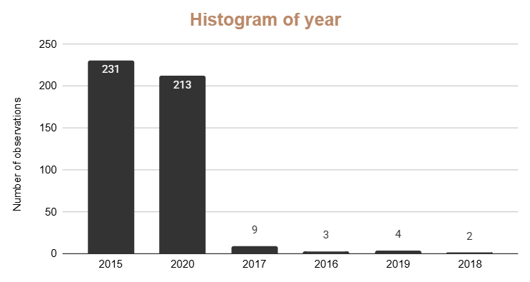
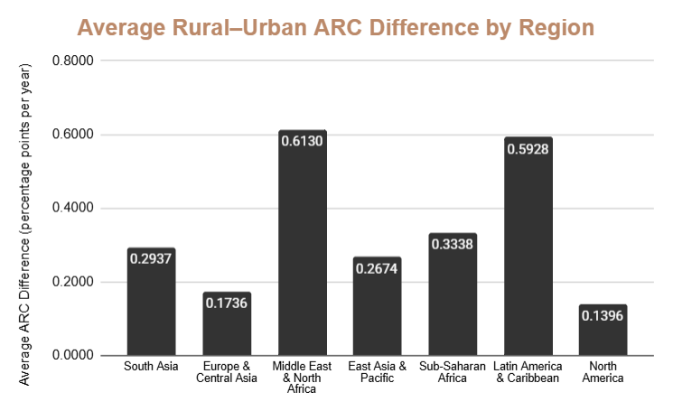
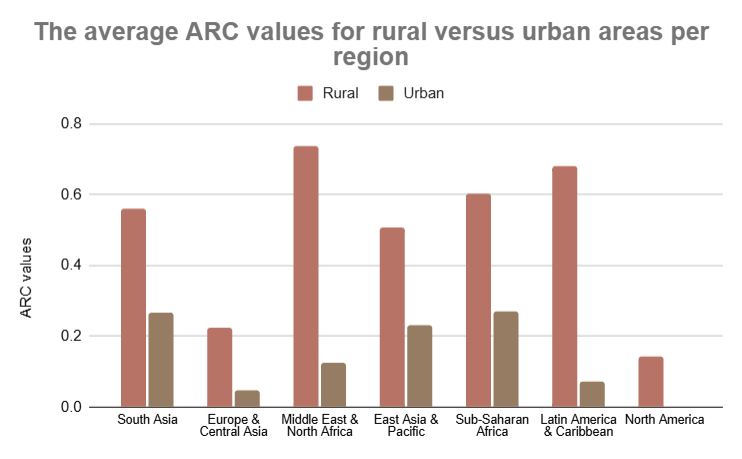
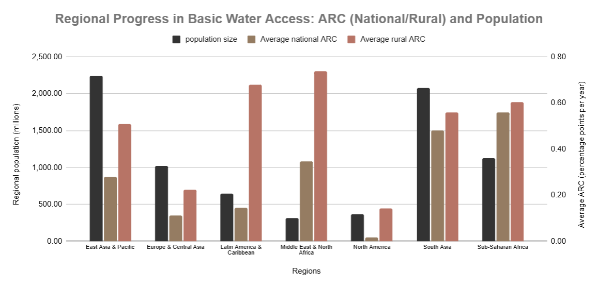

# Access to Drinking Water — Part 2: Transforming the Data

## Project Overview

This project analyzes global access to drinking water using country- and area-level estimates from the **WHO/UNICEF Joint Monitoring Programme (JMP)**.

Part 2 focuses on transforming a multi-year drinking-water dataset into a progress-monitoring framework using **Annual Rate of Change (ARC)**.

While Part 1 focused on understanding the 2020 snapshot of drinking-water access, Part 2 focuses on change over time:

> How has access to at least basic drinking water changed across countries, rural areas, urban areas, and regions?

The analysis was completed using Google Sheets as the main analytical workspace, with a focus on data transformation, feature engineering, progress measurement, regional aggregation, and visual storytelling.

---

## Analytical Objective

The objective of Part 2 is to measure and interpret progress in access to at least basic drinking-water services.

The analysis focuses on five core questions:

1. How are observation years distributed in the dataset?
2. How can access change be measured fairly across countries with different observation intervals?
3. Are national, rural, and urban populations improving at the same speed?
4. Are rural areas catching up with urban areas?
5. Which regions show stronger or weaker progress in basic drinking-water access?

---

## Working Spreadsheet

The full Google Sheets workbook used for the analysis is available here:

[Open Google Sheets Workbook](https://docs.google.com/spreadsheets/d/1weIUAGJtGo6sjmPyZFFgbhWa5AapxfpWcgB-moQ2_-s/edit?usp=sharing)

The workbook contains:

- source data
- transformed dataset
- regional lookup table
- derived features
- Annual Rate of Change calculations
- full-access classification fields
- rural–urban progress comparison
- summary tables
- regional aggregations
- visualizations
- spreadsheet exports

---

## Dataset Scope

The dataset contains drinking-water access observations for countries and territories between **2000 and 2020**.

The analytical grain is:

> One country or area observed in one specific year.

The dataset is not a complete annual panel. Most observations are concentrated in **2015** and **2020**, with a smaller number of observations appearing in intermediate years such as 2016, 2017, 2018, and 2019.

Because countries do not all have the same observation interval, the analysis uses a year-difference field before calculating Annual Rates of Change.

---

## Main Variables

| Variable | Description |
|---|---|
| `name` | Country or area name |
| `year` | Observation year |
| `pop_n` | National population estimate, stored in thousands |
| `pop_u` | Urban population share |
| `wat_bas_n` | National share with at least basic drinking-water access |
| `wat_bas_r` | Rural share with at least basic drinking-water access |
| `wat_bas_u` | Urban share with at least basic drinking-water access |
| `wat_lim_*` | Share with limited drinking-water access |
| `wat_unimp_*` | Share relying on unimproved drinking-water sources |
| `wat_sur_*` | Share relying on surface water |

The main Part 2 analysis focuses on the **at least basic** drinking-water variables because they are used to calculate progress over time.

For complete variable documentation, see:

[data/data_dictionary.md](./data/data_dictionary.md)

---

## Transformation Workflow

The data preparation and analysis process follows this structure:

```text
Source data
    ↓
Country and year sorting
    ↓
Year-difference calculation
    ↓
Annual Rate of Change calculation
    ↓
Missing-value and error handling
    ↓
Full-access classification
    ↓
Rural–urban ARC comparison
    ↓
Regional lookup and enrichment
    ↓
Summary tables and visual analysis
    ↓
Analytical reporting
```

---

## Key Derived Features

### `y_diff`

Measures the number of years between two observations for the same country.

```text
y_diff = later year - earlier year
```

This feature is used to:

- validate observation intervals
- detect duplicate country-year records
- provide the denominator for ARC calculations

---

### `ARC_n`

Measures the Annual Rate of Change in national access to at least basic drinking water.

```text
ARC_n =
(later national basic access - earlier national basic access)
/
year difference
```

---

### `ARC_r`

Measures the Annual Rate of Change in rural access to at least basic drinking water.

---

### `ARC_u`

Measures the Annual Rate of Change in urban access to at least basic drinking water.

All ARC values are interpreted in:

> Percentage points per year.

---

### Full-Access Classification Fields

The following fields identify countries where access was approximately 100% in both observation years:

- `ARC_n_full`
- `ARC_r_full`
- `ARC_u_full`

These fields separate countries already at full access from countries with zero progress below full coverage.

This prevents misleading interpretation of zero ARC values.

---

### `ARC_diff`

Compares rural and urban progress:

```text
ARC_diff = ARC_r - ARC_u
```

Interpretation:

- `ARC_diff > 0` — rural access improved faster
- `ARC_diff < 0` — urban access improved faster
- `ARC_diff ≈ 0` — rural and urban progress were similar

---

### `region`

Adds a regional classification to each country through a lookup table.

This allows the analysis to compare progress across:

- East Asia & Pacific
- Europe & Central Asia
- Latin America & Caribbean
- Middle East & North Africa
- North America
- South Asia
- Sub-Saharan Africa

---

## Repository Structure

```text
part-2-transforming-the-data/
├── assets/
│   ├── main_visuals/
│   ├── regional_arc_tables/
│   └── README.md
│
├── data/
│   ├── README.md
│   └── data_dictionary.md
│
├── reports/
│   ├── analytical_report/
│   │   └── Part2_Analytical_Report.md
│   ├── sheet_exports/
│   │   ├── Estimates of the use of water (2000-2020).pdf
│   │   ├── Summary.pdf
│   │   └── README.md
│   └── README.md
│
└── README.md
```

---

## Folder Guide

### `assets/`

[Open assets folder](./assets/)

Contains the main visual outputs and supporting regional ARC tables.

The folder is divided into:

- `main_visuals/` — primary charts used to communicate the main findings
- `regional_arc_tables/` — country-level regional tables supporting the aggregated analysis

---

### `data/`

[Open data folder](./data/)

Contains documentation for the data layer, including:

- dataset scope
- transformation workflow
- derived features
- missing-value conventions
- data-quality considerations
- full variable dictionary

---

### `reports/`

[Open reports folder](./reports/)

Contains the reporting layer, including:

- the full analytical report
- spreadsheet exports
- reporting documentation

The main analytical report is available here:

[Part2_Analytical_Report.md](./reports/analytical_report/Part2_Analytical_Report.md)

---

## Key Visuals

### 1. Year Distribution Histogram



This histogram examines how observation years are represented in the dataset.

Most records are concentrated in **2015** and **2020**, while only a small number of observations appear in intermediate years.

**Main insight:**  
The dataset is not a complete annual time series. It is mainly structured around selected observation years, which makes the `y_diff` feature essential for fair ARC calculation.

---

### 2. Average Rural–Urban ARC Difference by Region



This visual compares the average difference between rural and urban Annual Rates of Change across regions.

The metric is calculated as:

```text
ARC_diff = ARC_r - ARC_u
```

**Main insight:**  
All regional average differences are positive, meaning rural access improved faster than urban access on average across every region.

The strongest rural catch-up patterns appear in:

- Middle East & North Africa
- Latin America & Caribbean

---

### 3. Average Rural and Urban ARC by Region



This grouped column chart compares average rural and urban ARC values directly.

**Main insight:**  
Average rural ARC is higher than average urban ARC in every region.

This suggests a broad rural catch-up pattern, although faster rural progress does not automatically mean that rural access has surpassed urban access.

---

### 4. Regional Progress in Basic Water Access



This visual compares:

- regional population size
- average national ARC
- average rural ARC

**Main insight:**  
Population size alone does not explain progress patterns.

South Asia combines a large population with strong national and rural progress. Sub-Saharan Africa also shows meaningful ARC values across a large population, while Middle East & North Africa records the strongest rural progress despite representing a smaller population.

---

## Regional ARC Tables

Supporting country-level regional tables are available here:

[regional_arc_tables/](./assets/regional_arc_tables/)

These tables show the underlying country-level observations behind the regional averages.

They include:

- country or area name
- region
- observation year
- population
- national ARC
- rural ARC
- urban ARC

The tables are important because regional averages can hide country-level variation.

Countries within the same region may show:

- strong positive progress
- zero change
- negative progress
- missing values
- full-access conditions

---

## Main Findings

### 1. The dataset is mainly a 2015–2020 comparison

Most observations are concentrated in 2015 and 2020.

This means the dataset should not be treated as a complete annual time series. The analysis is better understood as a time-gap-based progress comparison.

---

### 2. ARC provides a fairer progress metric

Countries do not all have the same year gap.

Using `y_diff` allows access changes to be normalized by the actual number of years between observations.

This makes progress more comparable across countries.

---

### 3. Rural access improved faster than urban access

Average rural ARC is higher than average urban ARC across all regions.

This suggests that rural populations are generally catching up in terms of progress speed.

---

### 4. Faster rural progress does not mean the rural gap has disappeared

ARC measures speed of improvement, not final access level.

Rural populations may still have lower access levels even when their ARC is higher.

---

### 5. Urban ARC can be lower because of high baseline access

Many urban populations already had high or full access.

This creates a ceiling effect where limited remaining room for improvement results in lower ARC values.

---

### 6. Full-access classification improves interpretation

A zero ARC can mean either:

- no progress below full access
- already complete access

The full-access flags separate these two cases and prevent misleading interpretation.

---

### 7. Regional averages hide country-level variation

Countries inside the same region can show very different ARC patterns.

That is why the project includes regional ARC tables as supporting evidence.

---

### 8. Population scale matters

A moderate ARC in a highly populated region may represent a larger potential human impact than a high ARC in a smaller region.

ARC and population size should therefore be interpreted together.

---

## Regional Summary

| Region | Countries | Population (millions) | Avg `ARC_n` | Avg `ARC_r` | Avg `ARC_u` |
|---|---:|---:|---:|---:|---:|
| East Asia & Pacific | 40 | 2,247.54 | 0.28 | 0.51 | 0.23 |
| Europe & Central Asia | 64 | 1,017.48 | 0.11 | 0.22 | 0.05 |
| Latin America & Caribbean | 48 | 642.51 | 0.14 | 0.68 | 0.07 |
| Middle East & North Africa | 10 | 311.07 | 0.35 | 0.74 | 0.12 |
| North America | 5 | 368.87 | 0.02 | 0.14 | 0.00 |
| South Asia | 11 | 2,082.32 | 0.48 | 0.56 | 0.27 |
| Sub-Saharan Africa | 53 | 1,124.03 | 0.56 | 0.60 | 0.27 |
| Grand Total | 231 | 7,793.82 | 0.2767 | 0.4845 | 0.1548 |

---

## Reports

The full written report is available here:

[Part2_Analytical_Report.md](./reports/analytical_report/Part2_Analytical_Report.md)

Spreadsheet exports are available here:

[reports/sheet_exports/](./reports/sheet_exports/)

These exports preserve the final Google Sheets outputs used in the analysis.

They include:

- transformed dataset sheet
- summary/dashboard sheet

---

## Data Documentation

Dataset documentation is available here:

[data/README.md](./data/README.md)

Full variable documentation is available here:

[data_dictionary.md](./data/data_dictionary.md)

---

## Visual Assets

The visual assets folder is available here:

[assets/](./assets/)

It contains:

- main analytical charts
- regional ARC tables
- supporting country-level evidence

---

## Tools and Techniques Used

This project demonstrates the use of spreadsheet-based data analysis techniques, including:

- data transformation
- feature engineering
- row-level validation
- year-difference calculation
- Annual Rate of Change calculation
- error handling
- missing-value treatment
- full-access classification
- rural–urban comparison
- lookup-based regional enrichment
- summary tables
- regional aggregation
- visual analysis
- analytical reporting

---

## Limitations

This analysis is descriptive and exploratory.

It identifies patterns and progress rates, but it does not establish causality.

Main limitations include:

- the dataset is not a complete annual panel
- most observations are concentrated around 2015 and 2020
- some rural and urban values are missing
- regional ARC values are simple country-level averages
- regional averages are not automatically population-weighted
- ARC measures speed of progress, not final access level
- high ARC can reflect low baseline access
- low ARC can reflect already high access
- country-level context is needed for stronger interpretation

---

## Future Improvements

This project could be strengthened by:

- calculating population-weighted regional ARC
- comparing baseline access with final access levels
- ranking countries by strongest positive and negative ARC
- mapping ARC geographically
- building an interactive dashboard
- reproducing the workflow in Python or R
- connecting water-access progress with socioeconomic indicators
- adding confidence intervals or uncertainty measures if available
- creating country-level profiles for priority cases
- analyzing more years if additional data becomes available

---

## Skills Demonstrated

This project demonstrates the following data analysis skills:

- spreadsheet-based data transformation
- feature engineering
- time-based progress analysis
- Annual Rate of Change methodology
- data validation
- missing-value handling
- classification logic
- lookup-based enrichment
- regional aggregation
- visual analytics
- data storytelling
- documentation
- portfolio reporting

---

## Final Conclusion

Part 2 transforms the drinking-water access dataset into a structured progress-monitoring framework.

The analysis shows that access to at least basic drinking water generally improved across many countries and regions, with rural access improving faster than urban access on average.

However, faster rural progress does not mean that rural access gaps have disappeared. ARC measures the speed of improvement, while baseline access, final access level, population scale, and regional variation determine the real development significance.

The main conclusion is:

> Drinking-water access progress should be interpreted through both rate of change and context. ARC shows how fast access is improving, while access levels and population scale show how important that progress is.
