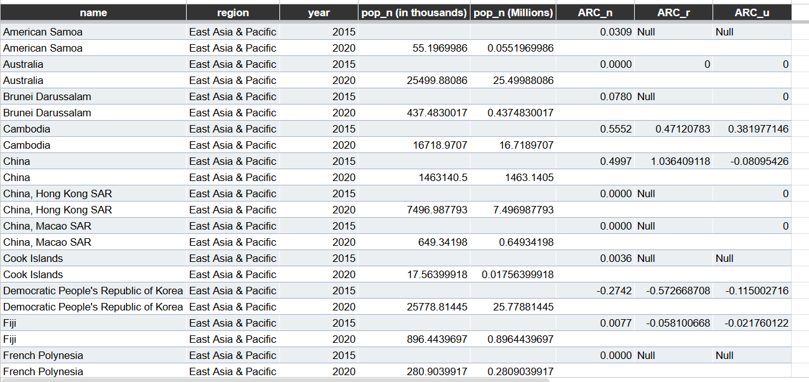
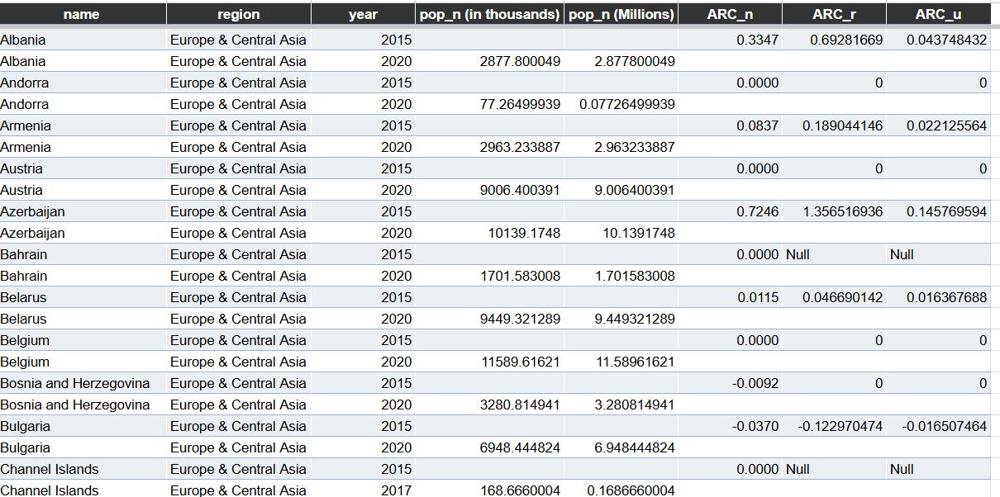
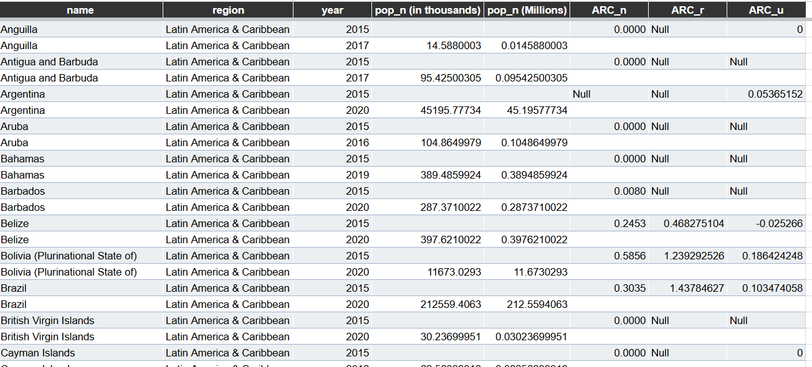
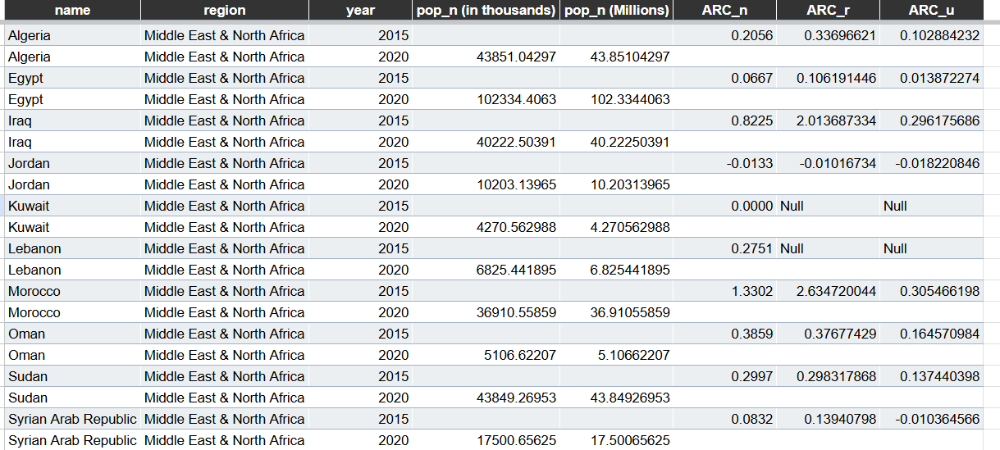
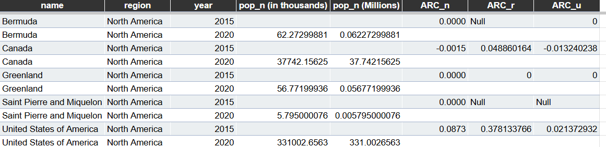
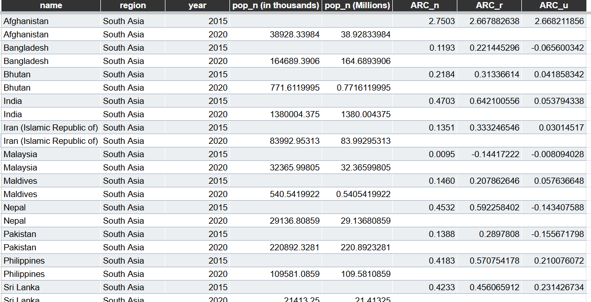
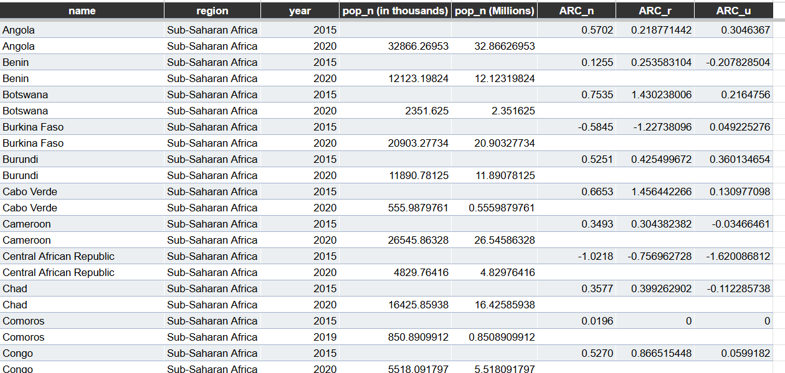

# Regional ARC Tables — Part 2: Transforming the Data

This folder contains country-level regional tables supporting the Annual Rate of Change analysis in Part 2 of the **Access to Drinking Water** project.

The tables provide the detailed observations behind the regional averages presented in the main visualizations. They make it possible to trace regional results back to individual countries and inspect differences in national, rural, and urban progress.

These tables are supporting analytical evidence rather than primary visual outputs.

---

## Variables Included

Each table contains the following fields:

| Variable               | Description                                          |
| ---------------------- | ---------------------------------------------------- |
| `name`                 | Country or area name                                 |
| `region`               | Regional classification                              |
| `year`                 | Observation year                                     |
| `pop_n (in thousands)` | National population estimate in thousands            |
| `pop_n (Millions)`     | National population converted to millions            |
| `ARC_n`                | Annual Rate of Change in national basic water access |
| `ARC_r`                | Annual Rate of Change in rural basic water access    |
| `ARC_u`                | Annual Rate of Change in urban basic water access    |

ARC values are interpreted in **percentage points per year**.

* `ARC > 0` indicates improvement.
* `ARC = 0` indicates no measured change or an already stable access level.
* `ARC < 0` indicates declining access.
* `Null` indicates that the ARC could not be calculated because the required values were unavailable.

---

## Table Structure

Each country is generally represented by two rows:

* the earlier observation year contains the calculated ARC values;
* the later observation year contains the population estimate used in the regional analysis.

This structure reflects the row-to-row calculation method used in the Google Sheets workbook.

The tables should therefore be interpreted by reading both rows belonging to the same country together.

---

## 01 — East Asia & Pacific

This table contains country-level ARC results for East Asia & Pacific.

### Notable observations

* **China** records positive national and rural ARC values, while its urban ARC is slightly negative.
* **Cambodia** shows positive progress across national, rural, and urban access.
* **Democratic People's Republic of Korea** records negative ARC values across all three population areas.
* **Fiji** shows a small positive national ARC but negative rural and urban values.
* Several countries and territories contain `Null` values where rural or urban estimates were unavailable.

### Analytical interpretation

The region shows considerable variation. Some countries experienced broad improvement, while others recorded declines or incomplete area-level data.

The strong rural ARC observed in countries such as China contributes to the region’s average rural progress, but the negative country-level cases show that the regional average does not describe every country equally.

---

## 02 — Europe & Central Asia

This table contains country-level ARC results for Europe & Central Asia.

### Notable observations

* **Azerbaijan** records strong positive rural progress relative to national and urban progress.
* **Albania** and **Armenia** show positive ARC values across population areas.
* **Bulgaria** records negative national, rural, and urban ARC values.
* Several countries, including **Austria**, **Belgium**, and **Andorra**, show zero ARC values.
* Some rural and urban values are unavailable and represented as `Null`.

### Analytical interpretation

The region contains many low or zero ARC values, which may reflect high baseline access and limited remaining room for improvement.

However, the presence of both strong positive and negative country-level results demonstrates that the regional average hides meaningful internal variation.

---

## 03 — Latin America & Caribbean

This table contains country-level ARC results for Latin America & Caribbean.

### Notable observations

* **Brazil** records strong rural improvement compared with its national and urban ARC values.
* **Bolivia (Plurinational State of)** also shows substantial rural progress.
* **Belize** records positive national and rural ARC values but a slightly negative urban ARC.
* Several island states and territories contain zero or unavailable ARC values.
* The region includes countries with different observation intervals, including 2015–2017, 2015–2019, and 2015–2020.

### Analytical interpretation

The table supports the strong rural catch-up pattern visible in the regional charts.

Large rural ARC values in countries such as Brazil and Bolivia raise the regional average, while urban progress remains smaller in several cases.

This explains why Latin America & Caribbean has one of the largest positive rural–urban ARC differences.

---

## 04 — Middle East & North Africa

This table contains country-level ARC results for Middle East & North Africa.

### Notable observations

* **Morocco** records very strong national and rural progress, with rural ARC substantially higher than urban ARC.
* **Iraq** also shows a high rural ARC compared with national and urban values.
* **Algeria**, **Egypt**, **Oman**, and **Sudan** record positive progress.
* **Jordan** records negative ARC values across national, rural, and urban access.
* Some countries contain unavailable rural or urban values.

### Analytical interpretation

The very high rural ARC values observed in Morocco and Iraq contribute strongly to the region’s leading average rural ARC.

The table confirms that the regional rural catch-up pattern is driven by substantial country-level improvements, although progress is not universal across the region.

---

## 05 — North America

This table contains country-level ARC results for North America.

### Notable observations

* **United States of America** shows positive national, rural, and urban ARC values, with rural progress higher than urban progress.
* **Canada** records a slightly negative national ARC, a positive rural ARC, and a slightly negative urban ARC.
* **Greenland** records zero ARC values.
* **Bermuda** and **Saint Pierre and Miquelon** contain unavailable rural or urban values.
* Population size varies substantially between the United States and the smaller territories represented.

### Analytical interpretation

North America has relatively low regional ARC averages.

This may reflect already high baseline access and limited room for further improvement rather than weak water access conditions.

The table also shows that the small positive regional rural–urban difference is influenced primarily by rural improvement in the United States and Canada.

---

## 06 — South Asia

This table contains country-level ARC results for South Asia.

### Notable observations

* **Afghanistan** records exceptionally high positive ARC values across national, rural, and urban populations.
* **India** shows positive progress, with rural ARC higher than national and urban ARC.
* **Bangladesh** records positive national and rural progress but a negative urban ARC.
* **Nepal** and **Pakistan** also show positive national and rural ARC values alongside negative urban ARC values.
* **Malaysia** records slightly positive national ARC but negative rural and urban ARC values.
* **Sri Lanka** shows positive progress across all three population areas.

### Analytical interpretation

South Asia combines strong country-level progress with one of the largest populations represented in the analysis.

Rural access improves faster than urban access in many countries, although Afghanistan’s unusually high ARC values may have a substantial influence on the regional average.

The regional result should therefore be interpreted alongside both country-level variation and population scale.

---

## 07 — Sub-Saharan Africa

This table contains country-level ARC results for Sub-Saharan Africa.

### Notable observations

* **Botswana** and **Cabo Verde** record strong positive rural ARC values.
* **Burundi**, **Congo**, and several other countries show positive national and rural progress.
* **Benin**, **Cameroon**, and **Chad** record positive national and rural ARC values but negative urban ARC values.
* **Burkina Faso** records negative national and rural ARC values while urban ARC remains slightly positive.
* **Central African Republic** records substantial declines across national, rural, and urban access, with the strongest decline visible in urban ARC.
* **Comoros** shows near-zero rural and urban change.

### Analytical interpretation

Sub-Saharan Africa shows the greatest diversity in country-level ARC outcomes among the displayed tables.

The region includes:

* countries making strong progress;
* countries with mixed rural and urban outcomes;
* countries experiencing substantial declines.

This variation explains why regional averages alone cannot fully represent the region’s water access trajectory.

The table supports the conclusion that Sub-Saharan Africa is making meaningful progress overall, but progress remains uneven and some countries continue to experience serious setbacks.

---

## Cross-Regional Findings

The seven regional tables support several broader conclusions.

### 1. Rural progress is frequently higher than urban progress

Many countries show `ARC_r > ARC_u`, which supports the positive average `ARC_diff` values observed across all regions.

This suggests that rural populations are generally catching up, although they may still have lower final access levels.

### 2. Regional averages hide substantial country-level variation

Countries within the same region may show:

* strong positive progress;
* zero change;
* negative progress;
* unavailable values.

Regional averages should therefore be interpreted as summary indicators, not as uniform regional outcomes.

### 3. High ARC values often reflect lower starting access

Countries with lower baseline access may show stronger ARC because they have more room for improvement.

A high ARC indicates faster progress, not necessarily high final access.

### 4. Zero ARC requires contextual interpretation

A zero ARC may indicate:

* no improvement below full access;
* already complete or nearly complete access;
* stable estimates between observations.

Full-access indicators and baseline values should be reviewed before classifying zero ARC as poor performance.

### 5. Negative ARC values identify priority cases

Negative ARC values indicate that access to at least basic drinking water declined between observations.

Countries such as the Central African Republic, Burkina Faso, Bulgaria, and the Democratic People's Republic of Korea illustrate why country-level inspection is important.

### 6. Population scale changes the significance of progress

Moderate ARC values in highly populated countries may affect more people than very high ARC values in small countries.

Population and ARC should therefore be considered together when assessing potential impact.

---

## Relationship to the Main Visuals

The tables in this folder support the charts stored in:

[`../main_visuals/`](../main_visuals/)

The main visuals summarize:

* year distribution;
* average rural–urban ARC difference by region;
* average rural and urban ARC by region;
* regional population size with national and rural ARC.

The regional tables provide the country-level observations behind those aggregated results.

---

## Data Interpretation Notes

* ARC values are calculated between two observations for the same country.
* The observation interval is not identical for every country.
* Missing values represented as `Null` were retained for transparency.
* Regional ARC figures are simple country-level averages unless otherwise specified.
* The regional averages are not automatically population-weighted.
* Screenshots display the Google Sheets calculation layout and may show ARC values and population values on different rows for the same country.
* These tables should be read as supporting evidence rather than standalone regional performance rankings.

---

## Portfolio Role

These regional tables demonstrate:

* data transformation;
* regional segmentation;
* population-unit conversion;
* country-level ARC calculation;
* handling of missing values;
* comparison of national, rural, and urban progress;
* traceability from summary charts to underlying records.

They strengthen the portfolio by showing that the regional findings are supported by transparent country-level calculations rather than only aggregated charts.
